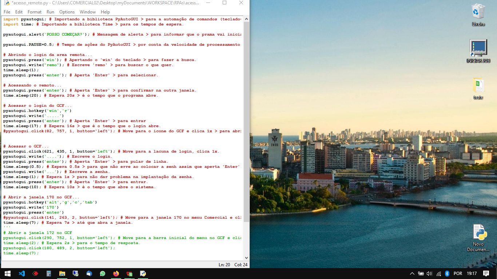

# Desktop Automation Bot ☕🤖

> **Nota de Estudo:** Este projeto foi um dos meus primeiros passos na automação com Python. Ele representa o início da minha jornada em busca de produtividade, focado em entender a lógica de controle de interface, antes de eu consolidar meus conhecimentos atuais em segurança e arquitetura.

---

## 📸 Demonstração do Bot

---

## ✨ A Ideia por trás do Projeto

Este script nasceu da vontade de automatizar aqueles 15 minutos iniciais do dia, onde abrimos as mesmas abas e ferramentas repetidamente. Foi meu laboratório para entender como o código pode interagir diretamente com o sistema operacional para economizar tempo humano.

**Em resumo:** Eu criei um "ajudante" que prepara meu ambiente enquanto busco um café, me permitindo focar no que realmente importa assim que sento na cadeira.

---

## 🚀 Como ele funciona (na prática)

O fluxo foi desenhado para ser o mais simples possível, focado em aprendizado de lógica:

1.  **Ativação:** Ao ligar o computador, executo o comando principal.
2.  **Execução:** O PyAutoGUI assume o controle, abre os softwares necessários e organiza as janelas no monitor.
3.  **Finalização:** Ao retornar, encontro tudo pronto e uma mensagem de boas-vindas: 
    > *"Tudo certo Rany, tenha um ótimo dia!"*

---

## 🛠️ Tecnologias e Ferramentas

* **Python:** Linguagem escolhida pela clareza e facilidade de manipulação de scripts.
* **PyAutoGUI:** Biblioteca utilizada para simular movimentos humanos de mouse e teclado.

---

## 📖 Reflexão Técnica

Como este foi um projeto de aprendizado inicial, o foco total foi na **funcionalidade e automação de interface**. Hoje, com minha experiência atual, utilizaria abordagens diferentes em termos de segurança de credenciais e estruturação de código, mas este repositório permanece aqui como um registro valioso da minha base técnica e curiosidade em resolver problemas reais.

---
Desenvolvido com ☕ por [Ranyeri Klennes](https://portfolio-ranyeri-klennes.vercel.app/) durante os primeiros passos na automação.
